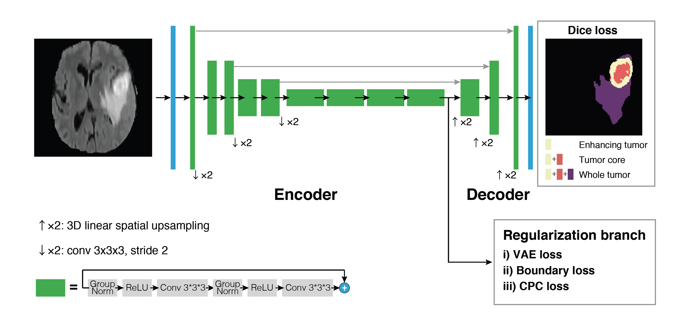

# Label-Efficient Multi-Task Segmentation using Contrastive Learning

This repository contains the Chainer implementated code used for the following paper:
> [1] **Label-Efficient Multi-Task Segmentation using Contrastive Learning**  
>Junichiro Iwasawa, Yuichiro Hirano, Yohei Sugawara  
> Accepted to MICCAI BrainLes 2020 workshop, [preprint on arXiv](https://arxiv.org/abs/2009.11160).
>
>
> **Abstract:** *Obtaining annotations for 3D medical images is expensive and time-consuming, despite its importance for automating segmentation tasks. Although multi-task learning is considered an effective method for training segmentation models using small amounts of annotated data, a systematic understanding of various subtasks is still lacking. In this study, we propose a multi-task segmentation model with a contrastive learning based subtask and compare its performance with other multi-task models, varying the number of labeled data for training. We further extend our model so that it can utilize unlabeled data through the regularization branch in a semi-supervised manner. We experimentally show that our proposed method outperforms other multi-task methods including the state-of-the-art fully supervised model when the amount of annotated data is limited.*

Disclaimer: PFN provides no warranty or support for this implementation. Use it at your own risk.

## Dependencies

We have tested this code using:

- Ubuntu 16.04.6
- Python 3.7
- CUDA 9.0
- cuDNN 7.0  

The full list of Python packages for the code is given in `requirements.txt`. These can be installed using:

```bash
pip install -r requirements.txt
```

## Usage

<p align="center">

</p>

The schematic image for the model is given above. To compare the effect of different regularization branches, we implemented four different models: the encoder-decoder alone (EncDec), EncDec with a VAE branch (VAEseg), EncDec with a boundary attention branch (Boundseg), and EncDec with a CPC branch (CPCseg). We have also implemented the semi-supervised VAEseg (ssVAEseg) and semi-supervised CPCseg (ssCPCseg) to investigate the effect of utilizing unlabeled data. The brain tumor dataset from the 2016 and 2017 Brain Tumor Image Segmentation ([BraTS](http://dx.doi.org/10.1109/TMI.2014.2377694)) Challenges was used for evaluation.

### Preparation

#### Normalization

The models were trained using images normalized to have zero mean and unit standard deviation. To normalize the original image data in the BraTS dataset (`imagesTr`), run the command below which will create a directory with normalized files (`imagesTr_normalized`).

```bash
python examples/normalize.py --root_path PATH_TO_BRATS_DATA/imagesTr
```

#### Generating boundary labels for boundseg

Boundseg model takes as input the boundary labels of the dataset. In order to generate boundary labels, run

```bash
python src/datasets/generate_msd_edge.py
```

after modifying `label_path` in the file.

#### Fixing training configs

- Before running the model, please specify the paths for `image_path`, `label_path`, (and `edge_path` for Boundseg) in the config files within `configs/`.

- When you want to change the number of labeled samples for training, rewrite `train_list_path` in the config file. For example, to use only 6 labeled data, rewrite it as `train_list_path: ./brats_split_list/train_list_cv0_6samples`.

### Training

#### EncDec

```bash
mpiexec -n 8 python3 examples/train.py \
    --config configs/brats_encdec.yml \
    --out results
```

#### VAEseg

```bash
mpiexec -n 8 python3 examples/train.py \
    --config configs/brats_vaeseg.yml \
    --out results
```

#### Boundseg

```bash
mpiexec -n 8 python3 examples/train.py \
    --config configs/brats_boundseg.yml \
    --out results
```

#### CPCseg

```bash
mpiexec -n 8 python3 examples/train.py \
    --config configs/brats_cpcseg.yml \
    --out results
```

#### ssVAEseg

```bash
mpiexec -n 8 python3 examples/train.py \
    --config configs/brats_semi_vaeseg.yml \
    --out results
```

#### ssCPCseg

```bash
mpiexec -n 8 python3 examples/train.py \
    --config configs/brats_semi_cpcseg.yml \
    --out results
```

## Results

The performances of the models, trained with 6 labeled samples (`train_list_cv0_6samples1.txt`), were evaluated by the mean dice score and 95th percentile Hausdorff distance using the test dataset (`brats_split_list/test_list_cv0.txt`) ([[1](#Label-Efficient-Multi-Task-Segmentation-using-Contrastive-Learning)], Table 1). For more detailed results, please see the paper [[1](#Label-Efficient-Multi-Task-Segmentation-using-Contrastive-Learning)].

|  | Dice (ET) | Dice (TC) | Dice (WT) | Hausdorff (ET) | Hausdorff (TC) | Hausdorff (WT) |
|:-|:---:|:--------:|:-----------------------:|:-----------------:|:-----------------------:|:-----------------:|
|EncDec    |0.8412 |0.8383 |0.9144 | 11.4697 |20.12 |24.3726 
|VAEseg    |0.8234 |0.8036 |0.8998 |14.3467 |22.4926  |17.9775 
|Boundseg  |0.8356 |0.8378 |0.9041 |17.0323 |27.2128 |25.8112
|CPCseg    |0.8374 |0.8386 |0.9057 |10.2839 |14.9661 |15.0633 
|ssVAEseg  |0.8626 |0.8425 |0.9131 |9.1966 | **12.5302**  |14.8056 
|ssCPCseg  | **0.8873** | **0.8761** | **0.9151** | **8.7092** |16.0947 | **12.3962**

## License

[MIT License](LICENSE)
